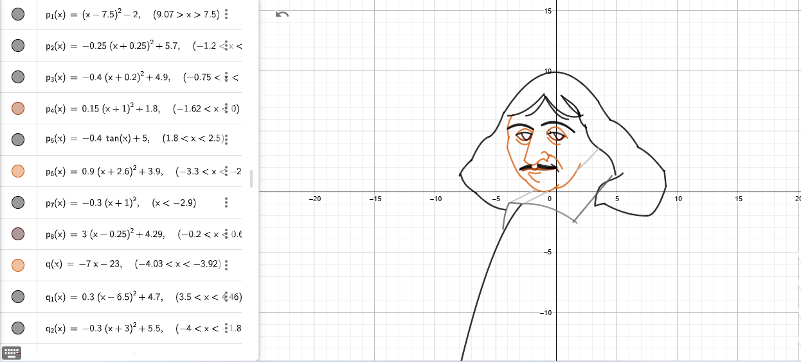

# Ibrahim Elmisbah

👋 I'm Ibrahim, a Sudanese econometrics student, debater, and researcher, passionate about economic development and evidence-based policymaking, tackling real-world challenges with data. <!-- Necessary long line.-->
Also, I'm an **ENTP** who loves exploring new things.
_____

## About Me

- 📊 **Econometrics Geek**: In my final year of econometrics, where I narrate economic tales with data visualizations.
- ✍️ **Translator Extraordinaire**: Currently translating *"Building State Capability"* into Arabic. Stay tuned—it’s coming soon!
- 🗣️ **Debate Architect**: I train youth to create the most convincing logical fallacies
- 📚 **Philosophy Enthusiast**: Once a philosophy maniac reading hundreds of pages daily, now "just interested."
<!-- Necessary long lines-->

_____

## Hobbies

- 📚 Reading *everything*—the more abstract, the better.  
- 🎨 Drawing on anything—paper, sand, lemons, Cartesian planes...
  Here’s my masterpiece:

 ### **Descartes in math functions**

  
_____

## Fun Facts

- 🏅 Ranked **Top 5** out of 500,000 in Sudan's Secondary School Certificate exams.
- 🗣️ Crowned **Second Best Speaker** in the International Debating Championship. Words are my superpower.<!-- Necessary long line-->

_____

## Favorites

| **Category**            | **Favorite**                                       |
|--------------------------|---------------------------------------------------|
| 🍽️ **Food**             | Shayaa                                            |
| 📚 **Book**             | *The History of Philosophy from Ancient Greek to Contemporary* |
| 📺 **Series**           | *Attack on Titan*                                 |
| 💻 **Programming Tool** | Visual Studio Code                                |
| 📊 **Subject**          | Probability & Statistics                          |
 <!-- Necessary long line, the name of the book is too long -->

_____

### *"The truth springs from argument amongst friends."* — *David Hume*

<!-- markdownlint-disable MD033 -->

  

